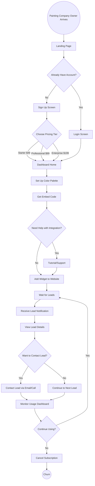
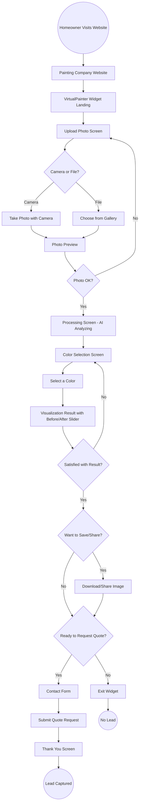

# VirtualPainter - User Flow Visualization

**Project**: Paint Color Visualizer (VirtualPainter)  
**Date Created**: December 15, 2025  
**Date Updated**: December 15, 2025  
**Workflow**: Vibe Mockup - Skill 2 (Updated with Mermaid Diagrams)

---

## Overview

VirtualPainter has two distinct user types with separate flows:
1. **Painting Company Owner** (B2B Customer) - Sets up and manages the widget
2. **Homeowner** (End User) - Uses the widget to visualize paint colors

---

## User Flow 1: Painting Company Owner

### Primary Goal
Set up the paint visualizer widget on their website and start receiving leads from homeowners.

### Main Steps
1. Discover VirtualPainter (via marketing, search, referral)
2. Sign up for account (choose pricing tier, start free trial)
3. Set up color palette (choose 12 paint colors for their company)
4. Get embed code (copy iframe/widget code)
5. Add widget to website (paste code into their site)
6. Receive leads (get notifications when homeowners use the tool)
7. Manage leads (view lead information in dashboard)
8. Monitor usage (check analytics and visualization counts)

### Decision Points
1. **After discovering VirtualPainter**: {Already have an account?}
   - Yes → Go to login
   - No → Go to sign up

2. **During sign up**: {Which pricing tier?}
   - Starter ($49) → 100 visualizations/month
   - Professional ($99) → 500 visualizations/month
   - Enterprise ($199) → Unlimited

3. **After setup**: {Need help with integration?}
   - Yes → Contact support / View tutorial
   - No → Continue on their own

4. **When viewing leads**: {Want to contact this lead?}
   - Yes → Click to email/call
   - No → Continue browsing leads

### Mermaid Diagram

### Screens Needed (Painting Company Owner)

1. **Landing Page** - Marketing page with features and pricing
2. **Login Screen** - Email/password login
3. **Sign Up Screen** - Registration with pricing tier selection
4. **Dashboard Home** - Overview of leads and usage
5. **Color Palette Setup** - Choose and preview 12 colors
6. **Embed Code Screen** - Copy widget code and instructions
7. **Tutorial/Support** - Help documentation
8. **Lead Details Screen** - View individual lead information
9. **Analytics Dashboard** - Usage stats and metrics
10. **Account Settings** - Billing, subscription management

---

## User Flow 2: Homeowner (End User)

### Primary Goal
Visualize their house in different paint colors and request a quote from the painting company.

### Main Steps
1. Visit painting company website
2. Find the VirtualPainter widget
3. Upload house photo (via camera or file)
4. Wait for AI processing (wall detection)
5. Browse color options (12 colors from company palette)
6. Select and apply colors to see visualization
7. Compare before/after views
8. Submit contact info for quote

### Decision Points
1. **Photo upload method**: {Camera or File?}
   - Camera → Take photo now
   - File → Choose from gallery

2. **After seeing result**: {Satisfied with result?}
   - Yes → Proceed to request quote
   - No → Try different color

3. **Before submitting**: {Want to save/share?}
   - Yes → Download or share image
   - No → Continue to quote request

4. **Final decision**: {Ready to request quote?}
   - Yes → Fill out contact form
   - No → Exit widget

### Mermaid Diagram

### Screens Needed (Homeowner/Widget)

1. **Widget Landing** - Call-to-action to upload photo
2. **Upload Photo Screen** - Camera/file upload options
3. **Photo Preview** - Confirm or retake photo
4. **Processing Screen** - Loading state with AI progress
5. **Color Selection Screen** - Grid of 12 color options
6. **Visualization Result** - Before/after comparison with slider
7. **Download/Share Screen** - Save or share options
8. **Contact Form** - Lead capture (name, email, phone)
9. **Thank You Screen** - Confirmation message

---

## Complete Screen List

### Painting Company Dashboard (10 screens)
1. Landing Page
2. Login Screen
3. Sign Up Screen
4. Dashboard Home
5. Color Palette Setup
6. Embed Code Screen
7. Tutorial/Support
8. Lead Details Screen
9. Analytics Dashboard
10. Account Settings

### Homeowner Widget (9 screens)
1. Widget Landing
2. Upload Photo Screen
3. Photo Preview
4. Processing Screen
5. Color Selection Screen
6. Visualization Result
7. Download/Share Screen
8. Contact Form
9. Thank You Screen

**Total Screens: 19**

---

## Key Interactions

### Painting Company Owner
- Click to sign up / log in
- Select pricing tier
- Choose colors from color picker
- Copy embed code to clipboard
- Click on lead to view details
- Click to email/call lead
- View analytics charts

### Homeowner
- Tap to upload photo (camera or file)
- Swipe before/after slider
- Tap color to preview
- Tap to download/share
- Fill out contact form
- Submit quote request

---

## Next Steps

✅ **Skill 1 Complete**: Lean Canvas created  
✅ **Skill 2 Complete**: User flows mapped with Mermaid diagrams  
⬜ **Skill 3**: Generate detailed mockups for each screen

Ready to move to **Mockup Generation** (Skill 3)?

---

**Created with**: Vibe Mockup Workflow  
**Date**: December 15, 2025  
**Updated**: December 15, 2025 (Converted to Mermaid diagrams)
