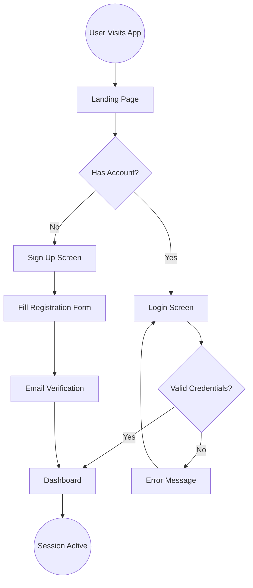

# User Flow Visualization Skill

## Overview

This skill helps you map out the user journey through your application and visualize it using Mermaid diagrams. A clear user flow is the blueprint for your mockups and ensures a logical, user-friendly experience.

## Process

### Step 1: Identify the Primary Goal
What is the primary goal the user wants to achieve when using your application?

### Step 2: List the Main Steps
Break down the user's journey into sequential steps or actions.

### Step 3: Identify Decision Points
Look for places where the user makes a choice that affects the flow (Yes/No branches, multiple options).

### Step 4: Describe Each Step
For each step, describe what the user does and what the system does in response.

### Step 5: Visualize the Flow
I will create a Mermaid diagram representation showing the complete user flow.

## Mermaid Diagram Notation

Mermaid uses a simple syntax that renders as visual flowcharts:

**Basic Syntax:**
```
graph TD
    Start[Starting Point] --> Action[User Action]
    Action --> Decision{Decision Point?}
    Decision -->|Yes| PathA[Path A]
    Decision -->|No| PathB[Path B]
    PathA --> End[End Point]
    PathB --> End
```

**Node Types:**
- `[Rectangle]` - Screen or user action
- `{Diamond}` - Decision point with Yes/No paths
- `((Circle))` - Start/End points
- `-->` - Flow direction
- `-->|Label|` - Labeled path (for decisions)

## Example

Here's an example for a simple login flow:



This renders as a visual flowchart showing:
- Entry point (User Visits App)
- Decision points (Has Account?, Valid Credentials?)
- Multiple paths (Login vs Signup)
- Error handling (Invalid credentials loop back)
- End state (Session Active)

## Output

I will provide:
1. A complete user journey description
2. Mermaid diagram code showing the complete flow
3. List of all screens/pages needed
4. Key interactions and decision points

The Mermaid diagram will render automatically on GitHub, in documentation tools, and most markdown viewers.

## Saving Your Progress

At any point, you can save your work to GitHub by typing:

```
save session
```

I will save your user flow and all previous work to the repository.

## Next Steps

Once complete, move to the mockup-generation skill to create visual specifications for each screen.
